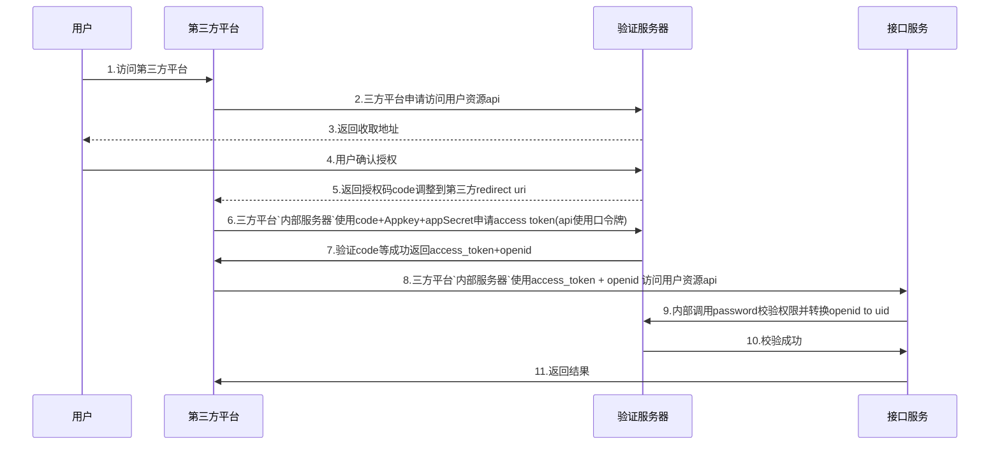

[TOC]
### 目录引用
1. 子文件夹引用[services](./services)
2. [vscode markdown扩展](https://shd101wyy.github.io/markdown-preview-enhanced/#/zh-cn/), 包含markdown语法教程.
3. [在线绘图工具](https://www.processon.com/view/59f2cb0ee4b0edf0e25b85d3?fromnew=1)

服务之间的相互调用采用sequence diagram来描述, 不同点在于:
1. 图片方式, 在任何preview_app环境下都可以看到;
2. 手写编码方式, 只能在vscode扩展下preview看到, gitee/github/visual_studio都不能看到. 
### mermaid方式

### 图片嵌入方式

### 原生markdown方式
```sequence
    用户->>第三方平台: 1.访问第三方平台
    第三方平台->>验证服务器: 2.三方平台申请访问用户资源api
    验证服务器-->>用户: 3.返回收取地址
    用户->>验证服务器: 4.用户确认授权
    验证服务器-->>第三方平台: 5.返回授权码code调整到第三方redirect uri
    第三方平台->>验证服务器: 6.三方平台`内部服务器`使用code+Appkey+appSecret申请access token(api使用口令牌)
    验证服务器->>第三方平台: 7.验证code等成功返回access_token+openid
    第三方平台->>接口服务: 8.三方平台`内部服务器`使用access_token + openid 访问用户资源api
    接口服务->>验证服务器: 9.内部调用password校验权限并转换openid to uid
    验证服务器->>接口服务: 10.校验成功
    接口服务->>第三方平台: 11.返回结果
```

图形补充:对象定义, 折行, 注释, 激活

### 消息代码示例
```cs
// ``` 前导符顶格写
// 紧跟 文件的后缀名，如cs、java、ts等。
using System.Drawing;
using System.Drawing.Printing;
namespace amazon{
    public class HelloWorld{
        public static void main(String[] args){
            Connection con1 = new Connection("localhost");
            // ...
            BasicConsumer bc1 = new BasicConsumer(con1,"",null);
            // ...
            Console.Writeline("Successfull!");
        }
    }
}
```
```html
<link src="http://phncdn.com/react-1.20.js"/>
<style type="text/css">
    div.info{
        color: #fff;
    }
</style>

```