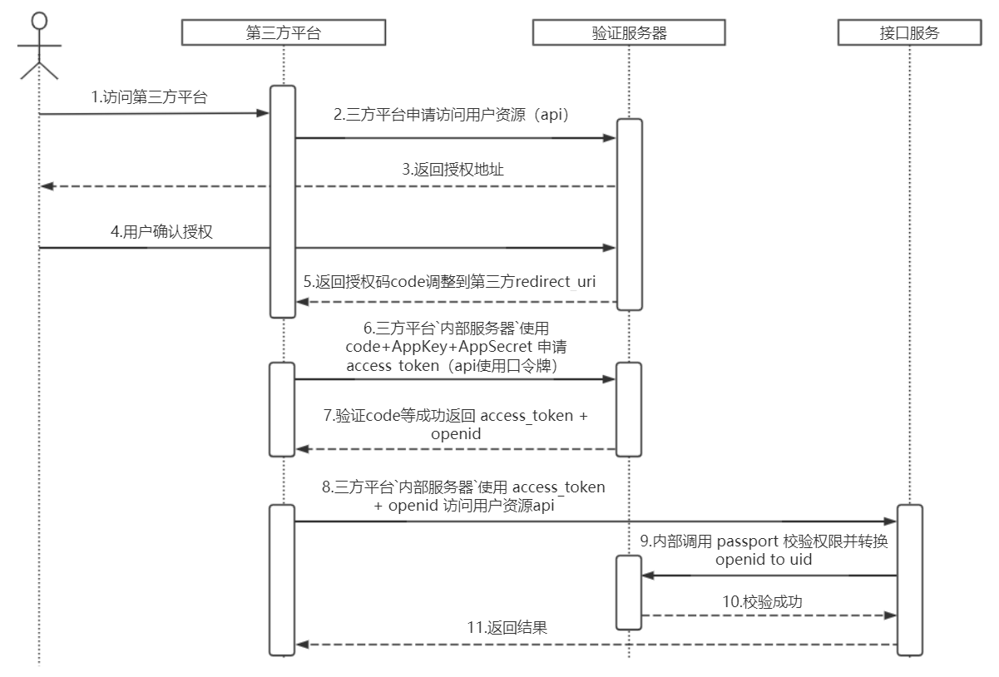

[TOC]
### 1.服务概要说明
1. [service1](/service1)
2. [service2](/service2)
3. [service3](/service3)
### 2.中台服务消息
消息说明
#### 2.1 被引用列表
|序号|应用名称|备注|
|:---|:---|:---|
| 1  | app1 | |
| 2  | app2 | |
#### 2.2 消息顺序图
```sequence
58MES->>任务中台: 1.请给我一批任务;
任务中台-->>58MES: 2.异步发送任务;
```

详细步骤说明
1. 

#### 2.3 示例代码
```cs
namespace amazon{
    public class HelloWorld{
        public static void main(String[] args){
            Connection con1 = new Connection("localhost");
            // ...
            BasicConsumer bc1 = new BasicConsumer(con1,"",null);
            // ...
            Console.Writeline("Successfull!");
        }
    }
}
```